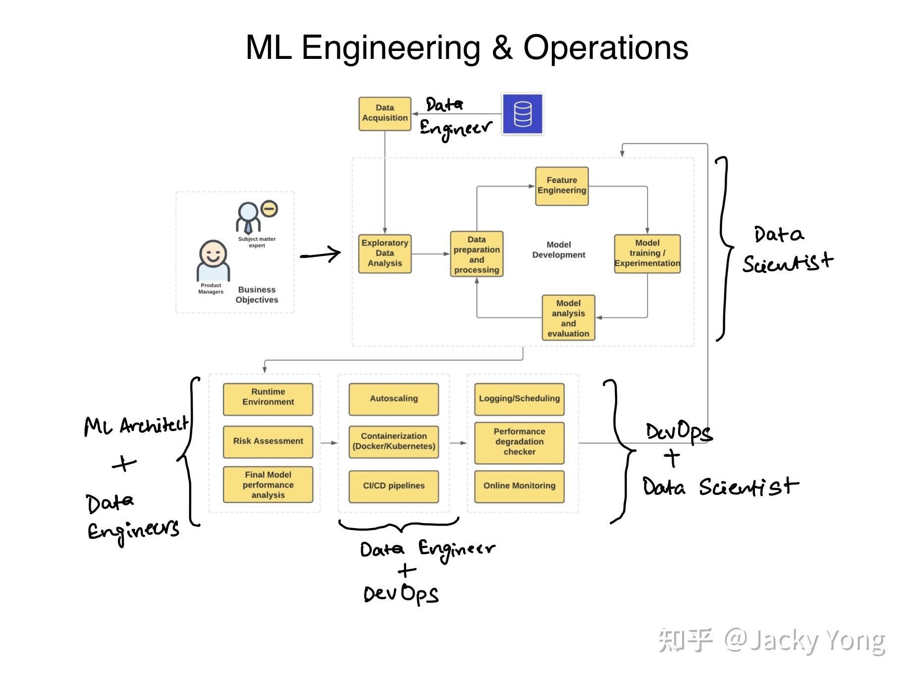

# Notes for Introduction of MachineLeaning Ops Course

------------------------
## What is machine learning

MLOps定义
MLOps是一门工程学科，旨在统一 ML 系统开发（dev）和 ML 系统部署（ops），以标准化过程生产高性能模型的持续交付。

为什么是 MLOps？
直到最近，我们还在处理可管理的数据量和小规模的极少量模型。现在情况正在转变，我们正在将决策自动化嵌入到广泛的应用程序中，这产生了许多来自构建和部署基于 ML 的系统的技术挑战。

要了解 MLOps，我们必须首先了解 ML 系统的生命周期。生命周期涉及数据驱动组织的多个不同团队。从头到尾，以下团队参与其中：

业务开发或产品团队——用 KPI 定义业务目标
数据工程——数据采集和准备。
数据科学 — 构建 ML 解决方案和开发模型。
IT 或 DevOps — 完成部署设置，与科学家一起进行监控。
这是 ML 生命周期的非常简化的表示。

## MLOps 解决的主要挑战
大规模管理此类系统并非易事，需要解决许多瓶颈。以下是团队提出的主要挑战：

缺乏擅长开发和部署可扩展 Web 应用程序的数据科学家。如今，市场上出现了一种新的 ML 工程师简介，旨在满足这一需求。它是数据科学和 DevOps 交叉点的最佳选择。
在模型中反映不断变化的业务目标——数据不断变化，维护模型的性能标准，确保人工智能治理，存在许多依赖关系。很难跟上持续的模型培训和不断发展的业务目标。
技术和业务团队之间的沟通鸿沟，难以找到共同的协作语言。大多数情况下，这种差距成为大型项目失败的原因。
风险评估——围绕此类 ML/DL 系统的黑盒性质存在很多争论。模型往往会偏离他们最初打算做的事情。评估此类故障的风险/成本是非常重要和细致的步骤。例如，与标记一个无辜的人进行欺诈、阻止他们的帐户和拒绝他们的贷款申请相比，YouTube 上不准确的视频推荐的成本要低得多。
主要阶段——掌握 MLOps 需要什么
在这一点上，我已经深入了解了系统的瓶颈以及 MLOps 如何解决这些瓶颈。您需要瞄准的技能可以从这些挑战中获得。

## 以下是您需要关注的关键技能：

1. 从业务目标出发构建机器学习问题
机器学习系统开发通常从业务目标或目标开始。它可以是将欺诈交易的百分比降低到 0.5% 以下的简单目标，也可以是构建一个系统来检测皮肤科医生标记的图像中的皮肤癌。

这些目标通常具有特定的性能度量、技术要求、项目预算和 KPI（关键性能指标），它们推动监控已部署模型的过程。

2.针对问题的架构ML和数据解决方案
在目标被清楚地转化为机器学习问题之后。下一步是开始搜索合适的输入数据以及要针对此类数据尝试的模型类型。

搜索数据是最艰巨的任务之一。这是一个包含多项任务的过程：

您需要寻找任何可用的相关数据集，
检查数据及其来源的可信度。
数据源是否符合 GDPR 等法规？
如何使数据集可访问？
源的类型是什么——静态（文件）或实时流（传感器）？
要使用多少个源？
一旦模型部署在生产环境中，如何构建一个可以驱动训练和优化的数据管道？
要使用哪些云服务？
3. 数据准备和处理——数据工程的一部分。
数据准备包括特征工程、清理（格式化、检查异常值、插补、重新平衡等）等任务，然后选择有助于输出潜在问题的特征集。

将设计一个完整的管道，然后编码以生成干净且兼容的数据，以提供给模型开发的下一阶段。

部署此类管道的一个重要部分是选择高性能且经济高效的云服务和架构的正确组合。 例如，如果您有大量数据移动和大量数据要存储，您可以考虑使用 AWS S3 和 AWS Glue 构建数据湖。

您可能想要练习构建几种不同类型的管道（批处理与流）并尝试将这些管道部署在云上。

4. 模型训练和实验——数据科学
准备好数据后，您就可以继续下一步训练 ML 模型。 现在，训练的初始阶段是用一堆不同类型的模型进行迭代。 您将使用准确度、精确度、召回率等多种量化指标缩小到最佳解决方案的范围，您还可以对模型进行定性分析，以解释驱动该模型的数学，或者简单地将模型的可解释性放在首位。

我有这个完整的任务列表，您可以在训练 ML 模型时阅读这些任务：

主要阶段——掌握 MLOps 需要什么
1. 从业务目标出发构建机器学习问题
2.针对问题的架构ML和数据解决方案
3. 数据准备和处理——数据工程的一部分。
4. 模型训练和实验——数据科学
5. 构建和自动化机器学习管道
6. 将模型部署到生产系统
7. 监控、优化和维护模型
进一步推荐阅读……
前言
ML（机器学习）系统开发生命周期和 MLOps 需求的完整演练

ML 系统工程和运营及其利益相关者

直到最近，我们所有人都在学习软件开发生命周期 (SDLC) 以及它如何从需求获取→设计→开发→测试→部署→一直到维护。 我们曾经（并且正在）研究软件开发的瀑布模型、迭代模型和敏捷模型。

现在，我们正处于几乎所有其他组织都试图将 AI/ML 纳入其产品的阶段。 构建 ML 系统的这一新要求增加/改革了 SDLC 的一些原则，所以产生了称为 MLOps 的新工程学科。

MLOps — 一个新术语出现了，它正在引起轰动并产生新的工作机会。 MLOps 是 Machine Learning Operations 的缩写，也称为 ModelOps。

下面我们就来聊聊：

什么是 MLOps
它解决的主要挑战是什么，以及
它由什么组成？
必须针对哪种技能和要求以及如何开始使用它？
在我展开每个部分时继续阅读。

查看谷歌趋势会告诉你，这是一个相对较新的学科，因为越来越多的组织正试图将 ML 系统集成到他们的产品和平台中。

MLOps定义
MLOps是一门工程学科，旨在统一 ML 系统开发（dev）和 ML 系统部署（ops），以标准化过程生产高性能模型的持续交付。

为什么是 MLOps？
直到最近，我们还在处理可管理的数据量和小规模的极少量模型。现在情况正在转变，我们正在将决策自动化嵌入到广泛的应用程序中，这产生了许多来自构建和部署基于 ML 的系统的技术挑战。

要了解 MLOps，我们必须首先了解 ML 系统的生命周期。生命周期涉及数据驱动组织的多个不同团队。从头到尾，以下团队参与其中：

业务开发或产品团队——用 KPI 定义业务目标
数据工程——数据采集和准备。
数据科学 — 构建 ML 解决方案和开发模型。
IT 或 DevOps — 完成部署设置，与科学家一起进行监控。
这是 ML 生命周期的非常简化的表示。

Google 的团队一直在对构建基于 ML 的系统所带来的技术挑战进行大量研究。 一篇关于机器学习系统中隐藏的技术债务的 NeurIPS 论文表明，开发模型只是整个过程的一小部分。 许多其他流程、配置和工具将被集成到系统中。

为了简化整个系统，我们拥有这种新的机器学习工程文化。 该系统涉及从具有最少技术技能的高级管理人员到数据科学家到 DevOps 和 ML 工程师的每个人。

MLOps 解决的主要挑战
大规模管理此类系统并非易事，需要解决许多瓶颈。以下是团队提出的主要挑战：

缺乏擅长开发和部署可扩展 Web 应用程序的数据科学家。如今，市场上出现了一种新的 ML 工程师简介，旨在满足这一需求。它是数据科学和 DevOps 交叉点的最佳选择。
在模型中反映不断变化的业务目标——数据不断变化，维护模型的性能标准，确保人工智能治理，存在许多依赖关系。很难跟上持续的模型培训和不断发展的业务目标。
技术和业务团队之间的沟通鸿沟，难以找到共同的协作语言。大多数情况下，这种差距成为大型项目失败的原因。
风险评估——围绕此类 ML/DL 系统的黑盒性质存在很多争论。模型往往会偏离他们最初打算做的事情。评估此类故障的风险/成本是非常重要和细致的步骤。例如，与标记一个无辜的人进行欺诈、阻止他们的帐户和拒绝他们的贷款申请相比，YouTube 上不准确的视频推荐的成本要低得多。
主要阶段——掌握 MLOps 需要什么
在这一点上，我已经深入了解了系统的瓶颈以及 MLOps 如何解决这些瓶颈。您需要瞄准的技能可以从这些挑战中获得。

以下是您需要关注的关键技能：

1. 从业务目标出发构建机器学习问题
机器学习系统开发通常从业务目标或目标开始。它可以是将欺诈交易的百分比降低到 0.5% 以下的简单目标，也可以是构建一个系统来检测皮肤科医生标记的图像中的皮肤癌。

这些目标通常具有特定的性能度量、技术要求、项目预算和 KPI（关键性能指标），它们推动监控已部署模型的过程。

2.针对问题的架构ML和数据解决方案
在目标被清楚地转化为机器学习问题之后。下一步是开始搜索合适的输入数据以及要针对此类数据尝试的模型类型。

搜索数据是最艰巨的任务之一。这是一个包含多项任务的过程：

您需要寻找任何可用的相关数据集，
检查数据及其来源的可信度。
数据源是否符合 GDPR 等法规？
如何使数据集可访问？
源的类型是什么——静态（文件）或实时流（传感器）？
要使用多少个源？
一旦模型部署在生产环境中，如何构建一个可以驱动训练和优化的数据管道？
要使用哪些云服务？
3. 数据准备和处理——数据工程的一部分。
数据准备包括特征工程、清理（格式化、检查异常值、插补、重新平衡等）等任务，然后选择有助于输出潜在问题的特征集。

将设计一个完整的管道，然后编码以生成干净且兼容的数据，以提供给模型开发的下一阶段。

部署此类管道的一个重要部分是选择高性能且经济高效的云服务和架构的正确组合。 例如，如果您有大量数据移动和大量数据要存储，您可以考虑使用 AWS S3 和 AWS Glue 构建数据湖。

您可能想要练习构建几种不同类型的管道（批处理与流）并尝试将这些管道部署在云上。

4. 模型训练和实验——数据科学
准备好数据后，您就可以继续下一步训练 ML 模型。 现在，训练的初始阶段是用一堆不同类型的模型进行迭代。 您将使用准确度、精确度、召回率等多种量化指标缩小到最佳解决方案的范围，您还可以对模型进行定性分析，以解释驱动该模型的数学，或者简单地将模型的可解释性放在首位。

我有这个完整的任务列表，您可以在训练 ML 模型时阅读这些任务：

几乎每个机器学习项目的任务备忘单
​towardsdatascience.com/task-cheatsheet-for-almost-every-machine-learning-project-d0946861c6d0
现在，您将使用不同类型的数据和参数运行大量实验。 数据科学家在训练模型时面临的另一个挑战是再现性。 这可以通过对模型和数据进行版本控制来解决。

您可以将版本控制与参数一起添加到 ML 系统的所有组件（主要是数据和模型）。

现在，通过 DVC 和 CML 等开源工具，这很容易实现。

其他任务包括：

通过为模型训练编写单元测试来测试模型。
根据基线、更简单的模型和跨不同维度检查模型。
使用分布式系统、硬件加速器和可扩展分析来扩展模型训练。
5. 构建和自动化机器学习管道
构建 ML 管道时应牢记以下任务：

确定系统需求——参数、计算需求、触发器。
选择合适的云架构——混合云或多云。
构建训练和测试管道。
跟踪和审计管道运行。
执行数据验证。
6. 将模型部署到生产系统
部署 ML 模型主要有两种方式：

静态部署或嵌入式模型是将模型打包成可安装的应用软件然后进行部署。例如，提供批量请求评分的应用程序。
动态部署——模型使用 FastAPI 或 Flask 等 Web 框架进行部署，并作为响应用户请求的 API 端点提供。
在动态部署中，您可以使用不同的方法：

部署在服务器（虚拟机）上
在容器中部署
无服务器部署
模型流——而不是 REST API，所有模型和应用程序代码都在 Apache Spark、Apache Storm 和 Apache Flink 等流处理引擎上注册。
以下是注意事项：

确保满足适当的文档和测试分数。
重新验证模型准确性。
执行可解释性检查。
确保满足所有治理要求。
检查任何数据工件的质量
负载测试——计算资源使用情况。
7. 监控、优化和维护模型
组织需要密切关注模型在生产中的表现，但要确保良好和公平的治理。 此处的治理意味着采取控制措施，以确保模型向所有受其影响的利益相关者、员工和用户履行其职责。

作为此阶段的一部分，我们需要数据科学家和 DevOps 工程师通过执行以下任务来维护整个系统的生产：

跟踪模型预测的性能下降和业务质量。
设置日志记录策略并建立持续评估指标。
排除系统故障和引入偏差。
在生产中部署的训练和服务管道中调整模型性能。